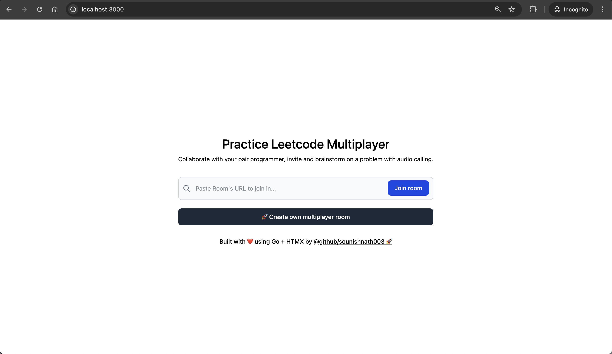
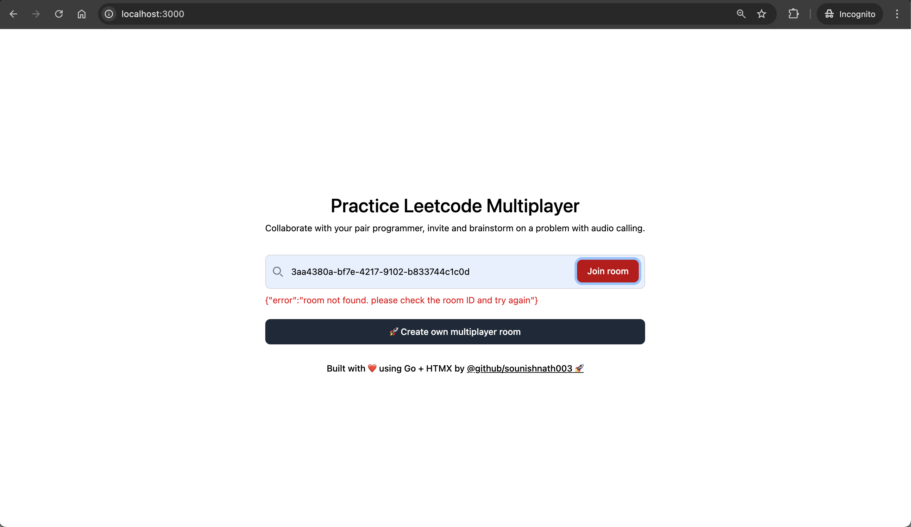
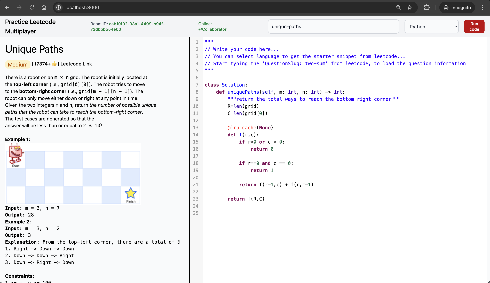

# Practice Leetcode Multiplayer

> NOTE: Project is just a thought. Do not expect to be maintain nicely. Not sure, about future plans.

This project is a multiplayer platform for practicing Leetcode problems. It allows users to collaborate and compete in solving coding challenges in real-time.

## YouTube Demo

[Practice Leetcode Multiplayer | Collaborate and practice together | Go + HTMX
](https://www.youtube.com/watch?v=c63zSC71rVM)

## Deployed Service URL: 

[practice-leetcode-multiplayer-797087556919.asia-south1.run.app](https://practice-leetcode-multiplayer-797087556919.asia-south1.run.app)

## Features

- **Rooms**: Create or join rooms to collaborate with others.
- **Chat**: Communicate with teammates using an integrated chat system.
- **Code Editor**: Solve problems with a simple and intuitive code editor.

## UI Screens:

### Create room or Join room:



### Collaborative Join (If Room doesn't exist):



### Multiplayer Screen:



## Getting Started

1. Clone the repository:
    ```bash
    git clone https://github.com/sounishnath003/practice-leetcode-multiplayer.git
    ```
2. Install dependencies:
    ```bash
    make install
    ```
3. Start the application:
    ```bash
    make run
    ```
4. Build docker image:
    ```bash
    # Build stage
    FROM golang:1.24-alpine AS builder

    WORKDIR /app

    COPY . .
    RUN go mod tidy && go mod download && go mod verify
    RUN CGO_ENABLED=0 go build -o /app/bin/practice_leetcode_multiplayer main.go

    # Final stage
    FROM scratch
    WORKDIR /app

    COPY --from=builder /app/bin/practice_leetcode_multiplayer /app/bin/practice_leetcode_multiplayer
    COPY --from=builder /app/templates/ ./templates/

    EXPOSE 3000
    ENTRYPOINT [ "/app/bin/practice_leetcode_multiplayer" ]
    ```


## Contributing

Contributions are welcome! Feel free to open issues or submit pull requests.
